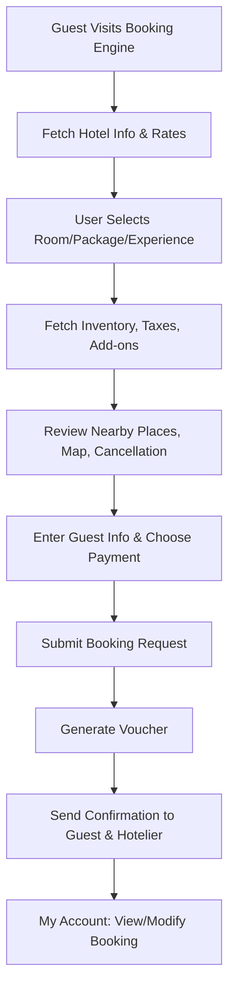

# 📋 Booking Lifecycle Documentation – BookingJini Booking Engine

---

## 🔀 Overview

The Booking Lifecycle in the BookingJini Booking Engine is designed to provide a seamless experience for guests booking hotel stays, packages, or experiences. It spans from discovery to post-booking actions, integrating APIs, user actions, and system logic.

---

## 📝 1. Discovery Phase

**Objective**: Help the guest explore options and gather necessary information.

| Component               | APIs Involved                                    | Description                                                           |
| ----------------------- | ------------------------------------------------ | --------------------------------------------------------------------- |
| Hotel Data Fetch        | `get-hotel-info`, `auth`, `hotels_by_company`    | Fetch hotel info, room types, rate plans, and property configuration. |
| Rate Calendar           | `calendar-rate-fetch`                            | Pulls 60-day rate and availability data to help with planning.        |
| Paid Services & Charges | `paid-services`, `add-on-charges`, `tax-details` | Lists optional extras, taxes, early check-in/late check-out fees.     |
| Plugin & Notifications  | `get-be-plugin-details`, `be-notifications`      | Loads plugin configuration and notifications.                         |
| Location & Nearby       | Google Maps Integration                          | Shows nearby places and embedded location map.                        |
| Offer Highlight         | `deal-of-the-day`                                | Displays special deals and OTA price comparisons.                     |
| Cancellation Policy     | UI Display                                       | Shown **without login**, ensuring transparency.                       |

---

## 🛌 2. Selection Phase

**Objective**: Allow the user to pick their preferred room/package/experience and proceed.

| Type                   | APIs Involved                                                              | Details                                                   |
| ---------------------- | -------------------------------------------------------------------------- | --------------------------------------------------------- |
| **Room Booking**       | `inventory-rate-fetch`                                                     | Real-time rate and availability fetch for selected dates. |
| **Package Booking**    | `get-package-list`, `get-package-details`, `package-availability`          | Shows all available packages and their day-wise plans.    |
| **Experience Booking** | `get-experience-list`, `get-experience-details`, `experience-availability` | Fetches event/activity options with time slots.           |

Features:

* Auto pricing calculation based on selections
* Taxes and add-ons are dynamically calculated
* Nearby places and maps shown in the UI
* Cancellation policy visible

---

## 💳 3. Booking & Payment Phase

**Objective**: Finalize selections, gather guest info, and initiate payment.

### Guest Actions

* Enters guest details (phone/email)
* Selects one of the available **payment methods**
* Accepts terms & cancellation policy

### Supported Payment Options

| Type              | Description                                 |
| ----------------- | ------------------------------------------- |
| **Prepaid**       | Full payment at the time of booking         |
| **Partial**       | Advance partial payment; rest paid on-site  |
| **Pay at Hotel**  | Full payment at the property                |
| **Bank Transfer** | Manual transfer and upload of payment proof |

---

## 📩 4. Booking Confirmation Phase

**Objective**: Finalize booking, notify stakeholders.

| API / Module                                                            | Purpose                                       |
| ----------------------------------------------------------------------- | --------------------------------------------- |
| `create-package-booking` / `create-experience-booking` / Booking Submit | Handles booking logic based on type           |
| `voucher-generator`                                                     | Generates and sends PDF voucher via email/SMS |
| Email/SMS Services                                                      | Sends confirmations to guest and hotelier     |

Guest is **auto-registered** using their phone number.

---

## 🔐 5. Post-Booking Phase (My Account)

**Objective**: Enable the guest to manage their booking.

### Features available in **My Account**:

* View voucher and booking details
* Modify/cancel bookings (if allowed)
* View cancellation policy again
* Access from mobile or desktop

---

## 📦 6. Package vs. Experience Lifecycle Difference

| Stage           | Package Booking             | Experience Booking          |
| --------------- | --------------------------- | --------------------------- |
| Duration        | Multi-day (stay + activity) | Single-day (event-only)     |
| Includes Stay   | ✅ Yes                       | ❌ No                        |
| Inventory Model | Date-based                  | Date & Time-slot based      |
| Payment Modes   | All 4 supported             | All 4 supported             |
| Booking APIs    | `create-package-booking`    | `create-experience-booking` |

---

## 🔔 Notifications & Miscellaneous

* **SMS/Email** sent at booking & modification stages.
* **Multilingual & Mobile-Responsive** UI.
* **Plugin Integration** for CMS embedding.
* **Cancellation Policy** is prominently visible across all flows.

---

## 🔄 End-to-End Flow Recap

---
